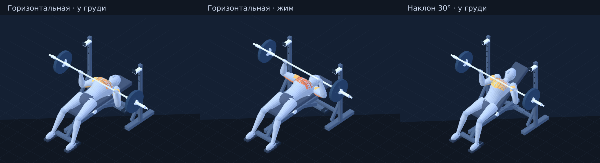

# Отдельный прототип жима · 0.1.0

Прототип расположен в `prototypes/bench-lab/`. Основной атлас 4.1.8 не заменён. Публичная демонстрация размещается в каталоге `/motion-lab/` существующего GitHub Pages.



## Что реализовано

- Горизонтальный жим и наклон 30°. У горизонтального варианта гриф опускается ниже по груди, у наклонного — выше. Нижнее положение предплечий проверяется относительно вертикали.
- Единая поза в метрах, две руки и ноги, неизменные длины сегментов, осевые системы вращения. Все четыре камеры показывают эту же позу.
- Объёмный учебный манекен из процедурных поверхностей: туловище, плечи, руки, таз, ноги, кисти с замкнутым хватом. Это первая версия оболочки вокруг скелета, не готовая анатомическая GLB-модель с полной деформацией кожи.
- Наклоняемая спинка, отдельное сиденье, рама, шарнир и опора спинки; стойки с держателями; гриф, втулки, блины и замки. Геометрия опор соответствует варианту жима.
- Верхняя, средняя и нижняя учебные области большой грудной мышцы. Верхняя соответствует ключичной части; средняя и нижняя — областям грудино-рёберной части. Видимые линии обозначают направление волокон и не являются отдельными каналами измеренной активности.
- Передняя часть дельтовидной и общий профиль трицепса. Длинная и латеральная головки трицепса окрашены одним общим профилем; глубокая медиальная головка не изображена поверх кожи. Самостоятельные кривые головок пока не заданы.
- Плавная смена цвета при опускании, паузах и жиме. Изоляция выбранной области, отключение подсветки, прокрутка повторения и скорость. Переключение ракурса/наклона сохраняет фазу. Изначально анимация стоит на паузе, скрытая вкладка останавливает её.
- WebGL-отображение и SVG-вариант при недоступном WebGL. Шрифты, графика и библиотека поставляются локально, обращения к CDN отсутствуют.

## Региональные профили и источники

Каждая область содержит отдельные узлы яркости для положений 0, 0.5 и 1 в концентрической и эксцентрической фазах. Это авторские **учебные кривые**, а не процент ЭМГ, сила мышцы или результат персональной физиологической симуляции. Значения фаз совпадают на концах, поэтому цвет не скачет в паузах и при изменении направления движения.

[Rodríguez-Ridao et al., 2020](https://pubmed.ncbi.nlm.nih.gov/33049982/) исследовали региональную ЭМГ при пяти наклонах. Работа поддерживает качественное различие акцентов между горизонтальным жимом и наклоном 30° в условиях эксперимента. Числа профиля цвета из статьи не заимствованы.

[Lauver et al., 2016](https://pubmed.ncbi.nlm.nih.gov/25799093/) обнаружили различия между областями грудных на отдельных участках повторения. Это дополнительно показывает, что одного постоянного цвета на весь повтор недостаточно для учебного объяснения; конкретная динамика зависит от условий измерения.

Реестр `MUSCLE_TREE` различает мышцу, анатомическую/учебную область и статус профиля. Изменение упражнения смещает акцент между областями, которые продолжают работать совместно. Полная изоляция отдельного пучка не обещается.

## Проверки

Из корня репозитория:

```sh
npm ci
npm --prefix prototypes/bench-lab ci
npm run check:all
```

Только прототип: `npm run check:lab`. Только аудит: `npm run audit:lab`. Отчёт сохраняется в `prototypes/bench-lab/public/audit-report.json` и публикуется рядом с демонстрацией.

- 101 положение каждого варианта: конечные координаты, постоянство длин, хват, диапазоны углов, положение предплечий внизу, вращения, стопы, опора тела, направление и угол подушки, контакт и покрытие, гриф/голова/туловище/стойки/пол.
- 401 точка цикла каждого варианта: все области имеют корректные кривые, паузы сохраняют вовлечённость, переходы не дают вспышек. Профиль обязательно помечен `illustrative`.
- 21 положение каждого варианта при двух размерах экрана: конечные точки нарисованных сегментов совпадают со скелетом, нарисованные ладони совпадают с хватом, подошвы стоят на полу. Лучи сверяют настоящие поверхности спины/головы и подушки с точками контакта. Проверяются четыре камеры и отсутствие обрезания объектов.
- Отрицательные тесты воспроизводят изменённую длину кости, оторванную кисть, дрейф стопы, скамью с неверной стороны, зазор, неправильный наклон, блин в полу, сломанную осевую ориентацию, отсутствующую область, неверную основу профиля, вспышку цвета. Отдельно меняются только нарисованные кисть/подушка и масштаб камеры, чтобы проверка не ограничивалась декларациями модели.
- DOM-проверки: фаза сохраняется при смене камеры/наклона; переключатели меняют материалы, подписи и состояния кнопок; скорость, прокрутка и скрытие вкладки останавливают/меняют воспроизведение.
- Готовая сборка: разрешаются локальные ссылки; настоящая упакованная программа запускается в JSDOM с отсутствующим WebGL и рисует сцену через SVGRenderer. Это не тест браузерного WebGL и не скриншот браузера.

На момент подготовки: 23 теста прототипа и 34 теста основной программы прошли; аудит прототипа — 202 позы, 802 фазовых кадра, 336 камерных проекций, 0 ошибок. В основном атласе остаются прежние 12 флагов ручного просмотра для шести 2D-упражнений.

## Границы прототипа

Аудит проверяет учебную геометрию и объявленные контакты. Он не оценивает индивидуальную подвижность, медицинскую безопасность или мышечную силу. Проверки поверхностей и пересечений целевые; общего решателя столкновений для всех пар объектов пока нет. Плавность и WebGL-вид на настоящем Android нужно оценить на телефоне.

SVGRenderer используется для воспроизводимых изображений сцены. `node prototypes/bench-lab/tools/render-preview.mjs` сохраняет SVG; PNG создаются дополнительно при доступном Sharp через `CODEX_PRIMARY_RUNTIME_NODE_MODULES`. В WebGL сглаживание, освещение и тени отличаются от SVG.

Масштабирование атласа: перенос существующих движений на пространственный скелет, библиотека моделей оборудования и контактов, проверенные региональные профили. Замена процедурной оболочки на лицензированную модель с корректной деформацией кожи — отдельный этап.

Three.js 0.180.0 используется по MIT; лицензия включена в опубликованные файлы. Сторонние модели тела/оборудования не использованы.
