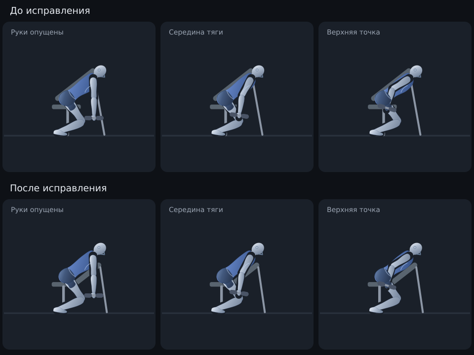
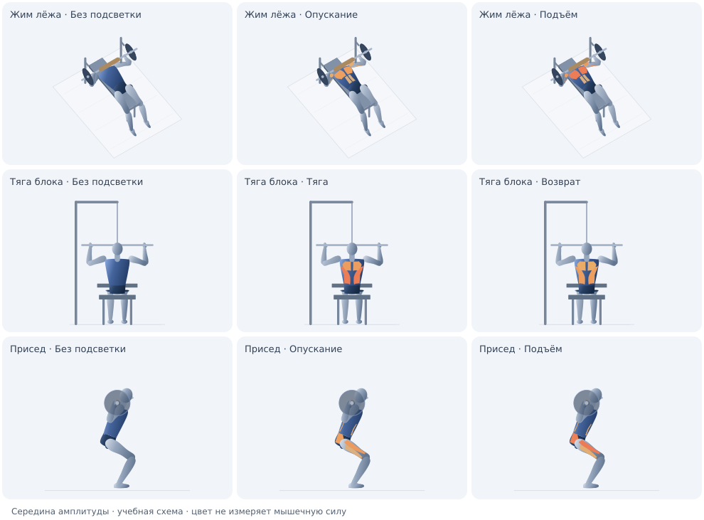

# Манекены и подсветка мышц

В версии 4.1.6 добавлен пилот на нынешнем SVG-манекене: жим лёжа, тяга верхнего блока и присед. Полноценная анатомическая 3D-модель остаётся следующим этапом.

В 4.1.7 исправлена боковая демонстрация тяги гантелей с опорой грудью. Подушка перенесена со стороны спины под грудь, укорочена до плеч, сиденье и передняя стойка соединены с новым положением. Корпус и стопы сохраняют опору по всей амплитуде. Аудит проверяет сторону, контакт с нарисованным контуром груди, покрытие, угол подушки и неподвижность опор в 101 положении. Отрицательный тест воспроизводит именно прежние координаты скамьи на спине.

## Что уже есть

Рисунок строится из SVG. У 13 упражнений есть общий пространственный скелет и несколько проекций, остальные используют схемы спереди или сбоку. Движок знает координаты суставов и точку амплитуды; проигрыватель знает рабочую фазу, возврат и паузы. У упражнений перечислены основные (`pri`) и вспомогательные (`sec`) мышцы. В трёх упражнениях поверх силуэта нанесены схематичные мышечные зоны, связанные с сегментами скелета.

## Реализованный пилот: подсветка на нынешнем манекене

Профили, поверхности и кривые находятся в `src/js/09b-muscle-profiles.js`. Подсветка доступна в карточках, атласе и режиме тренировки; переключатель «Мышцы по фазам» сохраняется для всех трёх режимов. В атласе и тренировке есть легенда, названия мышц, роли и словесная яркость. Кривые помечены `curveBasis: 'illustrative'`: это параметры учебного рисунка. Ссылки в профилях подтверждают состав мышц/технику, а не числовые кривые.

- Зоны груди, передней дельты, бицепса, трицепса, широчайших, середины спины, пресса, разгибателей спины, ягодичных, квадрицепса и задней поверхности бедра строятся в координатах тела. Поверхности, направленные от камеры, скрываются; порядок глубины связан с сегментами тела и реквизитом. Это приближённая видимость SVG, не полноценный буфер глубины.
- Для жима добавлен вид сверху под углом, для тяги и приседа — сзади. Два ракурса используют одну позу, фазу и цвет. Для второго ракурса пилота по умолчанию выбирается анатомически полезный вид.
- Рабочая фаза и возврат могут различаться при одинаковой позе. В паузах значения сохраняются; общие конечные узлы кривых и плавная интерполяция исключают скачки при развороте. Опускание не выключает мышцы.
- Роли «основная / вспомогательная / стабилизатор» и словесная яркость дублируют цвет. Числовых процентов силы или ЭМГ в интерфейсе нет.
- Без готового профиля силуэт остаётся нейтральным; интерфейс объясняет, для каких упражнений доступен пилот. Автоматических кривых для всех 139 упражнений нет.

Пилот работает без внешних моделей и сетевых запросов. Сборка включает слои и профили в офлайн-HTML на русском и английском. Объём тела, вращение плеча и деформация кожи остаются схематичными.

Одна и та же поза в середине амплитуды: нейтральный силуэт и две фазы. Это отдельный рендер настоящих SVG, а не снимок интерфейса.

## Второй этап: более реалистичное тело

Нужен один универсальный человек с анатомическими пропорциями, скелетом и корректным сгибанием суставов. Возможны собственная упрощённая модель или лицензированная GLB-модель, допускающая распространение в приложении.

Для модели нужны:

- Зоны мышц как отдельные поверхности, материалы или маски с идентификаторами, совпадающими с базой упражнений.
- Веса привязки поверхности к костям: локти, плечи и колени должны деформировать тело без разрывов и чрезмерного сжатия.
- Ориентации костей, поворот предплечья/кисти, движение плечевого пояса, таза и стоп. Нынешних координат конечных точек недостаточно для достоверного вращения кожи и мышечных зон вокруг кости.
- Перенос существующих движений на модель с сохранением хвата, опор и ограничений длины. Дополнительные ракурсы получаются из одной позы.
- Мягкое освещение, тень контакта с полом/скамьёй и правильное перекрытие телом и реквизитом. Детализацию лица и текстуры можно оставить простыми.

Для полноценного объёмного рендера предлагается Three.js: `SkinnedMesh` связывает поверхность со скелетом, а цвет/свечение материала позволяет подсвечивать зоны. Библиотека, модель и текстуры должны поставляться локально; для одного офлайн-HTML потребуется встроить ресурсы в сборку. Производительность следует проверять на Android с двумя ракурсами и несколькими карточками; нельзя заранее считать её подтверждённой.

## Что означает цвет

Цвет, зависящий от амплитуды, реализовать можно. По координатам суставов нельзя получить достоверное индивидуальное мышечное напряжение. Для оценки силы нужны данные о внешней нагрузке, геометрии рычагов, свойствах мышц/сухожилий, длине и скорости изменения мышечных волокон и активации. В OpenSim активация, длина и скорость волокон разделены, а активная сила использует их взаимосвязь. Даже ЭМГ требует осторожной интерпретации при оценке силы.

В интерфейсе подпись «Мышцы по фазам» сопровождается пояснением: «Учебная схема: цвет не измеряет силу или ЭМГ. Кривые яркости условные». Более яркая мышца не означает лучшее упражнение. Если позже будет добавлена расчётная модель нагрузки, отображать её отдельно и указывать допущения.

## Проверки и оставшиеся ограничения

- `npm test` проверяет границы кривых, непрерывность, разные фазы при одинаковой позе, длительные/нулевые паузы, видимость передних/задних поверхностей и сохранность скелета/контактов.
- `npm run audit` дополнительно проверяет мышечные поверхности в 101 положении каждого профиля, допустимый диапазон/роль кривых, общие значения на развороте и наличие объявленных проекций. Ошибочная кривая или неизвестная камера дают ошибку, а не скрываются ограничением цвета/запасным ракурсом.
- Проверены переключение, перемотка, оба ракурса и режим тренировки в DOM русской/английской сборок; рисунки проверены отдельным рендером SVG. Проверка на реальном телефоне и в браузере остаётся необходимой перед выпуском.
- Односторонние упражнения ещё не входят в пилот: для них нужны отдельные роли/кривые активной и опорной стороны. Разделение мышц на поверхности и их деформация потребуют дальнейшей визуальной настройки.

## Источники для реализации и интерпретации

- [Three.js: SkinnedMesh](https://github.com/mrdoob/three.js/blob/master/src/objects/SkinnedMesh.js)
- [Three.js: MeshStandardMaterial](https://github.com/mrdoob/three.js/blob/master/src/materials/MeshStandardMaterial.js)
- [OpenSim: интерфейс мышцы и параметры силы](https://github.com/opensim-org/opensim-core/blob/main/OpenSim/Simulation/Model/Muscle.h)
- [Roberts & Gabaldón, 2008: прямые измерения силы и связь с ЭМГ](https://pubmed.ncbi.nlm.nih.gov/21669793/)
- [Lauver et al.: грудные, передняя дельта и трицепс в жиме лёжа](https://pubmed.ncbi.nlm.nih.gov/25799093/)
- [Lehman et al.: широчайшие, бицепс и середина спины в тягах](https://pubmed.ncbi.nlm.nih.gov/15228624/)
- [Мышечные моменты суставов в приседе: исследование](https://pubmed.ncbi.nlm.nih.gov/33136769/)
